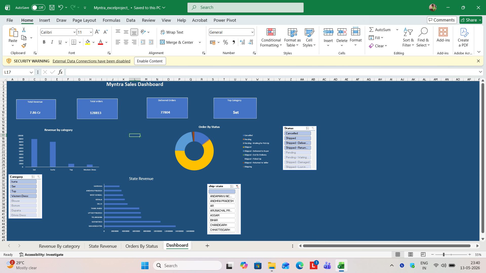
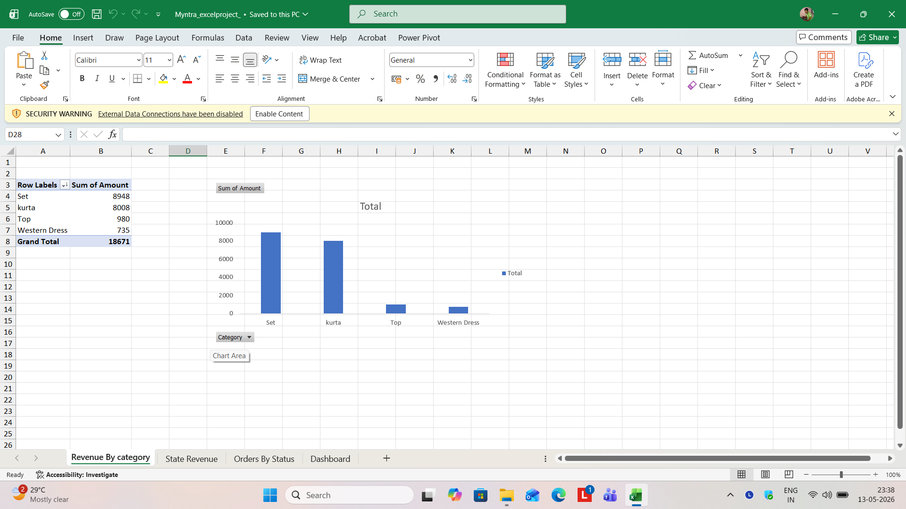
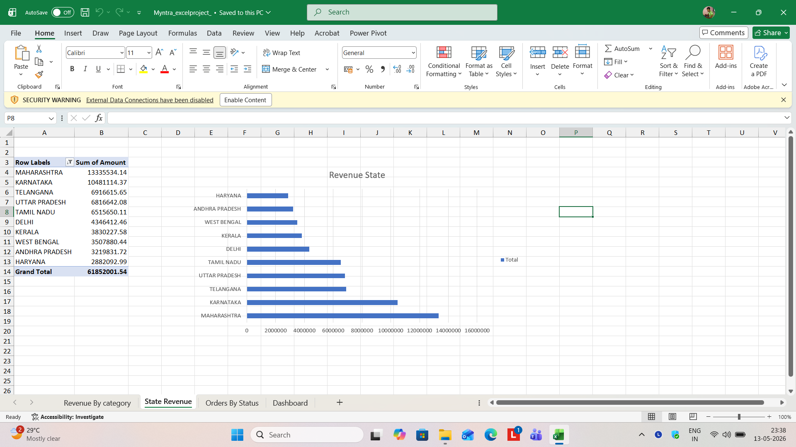
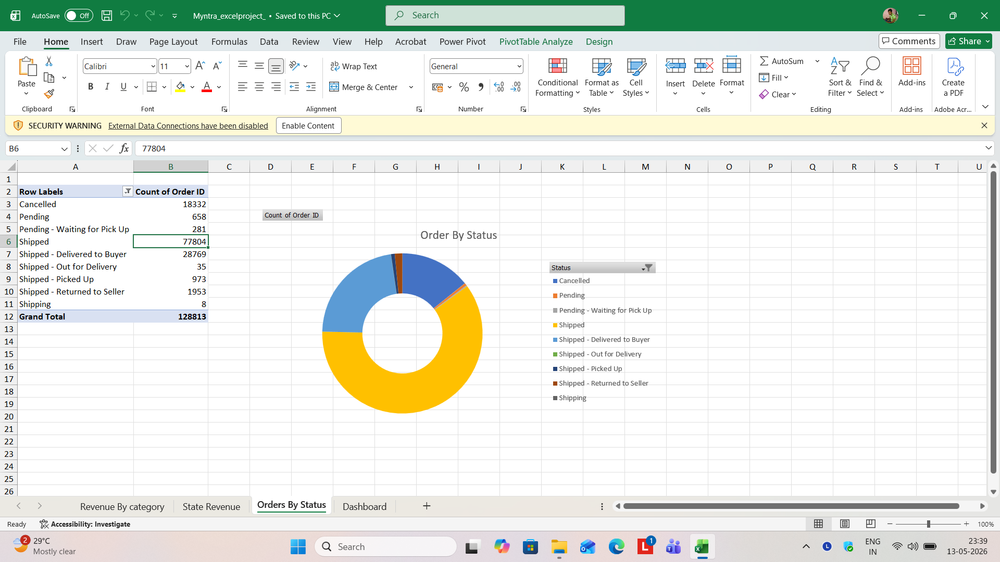

Myntra Sales Analysis

Project Overview

This project analyzes Myntra sales data using SQL and Microsoft Excel dashboards to identify sales trends, category performance, order status insights, and state-wise revenue patterns.

The project combines SQL-based data analysis with interactive Excel dashboard visualization for business reporting and decision-making.

---

Tools Used

- MySQL
- Microsoft Excel
- Pivot Tables
- Pivot Charts
- KPI Cards
- Slicers
- GitHub

---

Analysis Performed

- Total Orders Analysis
- Revenue Analysis
- Top Category Analysis
- State-wise Revenue Analysis
- Order Status Analysis
- KPI Dashboard Creation

---

Dashboard Features

- Interactive KPI Dashboard
- Revenue by Category Visualization
- Order Status Tracking
- State Revenue Analysis
- Dynamic Filtering using Slicers
- Interactive Excel Dashboard

---

Dashboard Preview

---

Key Insights

- Set category generated the highest overall revenue among all product categories.
- Maharashtra recorded the highest state-wise sales revenue.
- Shipped orders contributed the majority of total order volume.
- Interactive slicers improved filtering and helped analyze category, state, and order status trends dynamically.
- Revenue concentration was higher in major states, indicating stronger regional demand patterns.

---

Business Recommendations

- Increase marketing focus on high-performing categories like Set and Kurta.
- Improve logistics and customer support to reduce cancelled and returned orders.
- Target top-performing states with promotional campaigns and inventory expansion.
- Monitor category and state performance regularly using dashboard filters.

---

Files Included

- Myntra Excel Dashboard
- SQL Analysis Queries
- Dashboard Screenshots
- README Documentation

---

Author

Himanshu Rai
